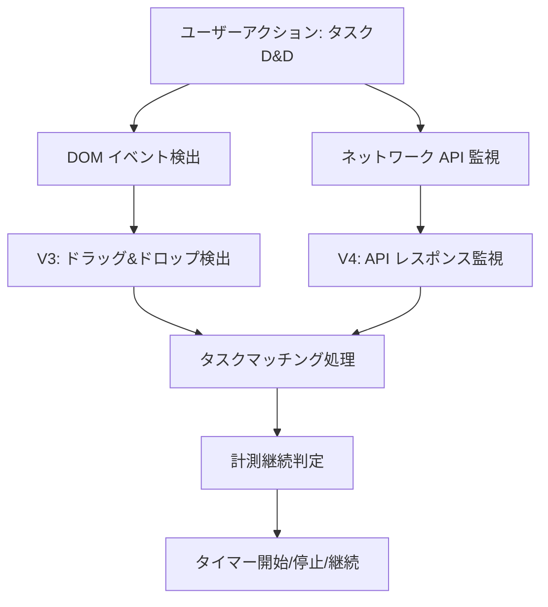

# Backlogタスク取得処理設計書

## 概要

BacklogのKanbanボードでタスクのステータス変更を検出し、時間計測の開始・停止を自動制御するシステムの設計。

## システム要件

### 主要機能
1. **タスクステータス変更の検出**
   - ドラッグ&ドロップによるタスク移動
   - APIレスポンスからの状態変化検出

2. **計測中タスクとの照合**
   - issueKey + spaceId + title による精密マッチング
   - アクティブタイマーとの照合

3. **タイマー制御**
   - 設定されたステータスでの計測開始/継続
   - 非計測ステータスへの移動時の停止

## アーキテクチャ

### 1. 検出手法のハイブリッドアプローチ



### 2. コンポーネント構成

#### Content Scripts
- **content-backlog-v3.js**: メインの検出・制御ロジック
- **content-backlog-v4.js**: API専用検出（参考実装）

#### DevTools Integration
- **devtools.js**: Network API監視
- **devtools.html**: DevTools拡張

#### Background Service
- **background.js**: タイマー管理とデータ永続化

## データフロー

### 1. タスク情報の抽出

```javascript
// APIレスポンスから取得される主要データ
const taskInfo = {
  id: generateTaskId(issueKey, issueId),
  title: issue.summary,
  status: issue.status.name,
  issueKey: issue.issueKey,        // 一意識別子
  issueId: issue.id,
  projectId: issue.projectId,
  projectName: getProjectName(),
  spaceId: getSpaceId()            // Backlogスペース識別子
}
```

### 2. マッチング戦略

```javascript
// 優先度の高い順にマッチング
if (issueKeyMatch && spaceMatch) {
  // 🎯 最優先: issueKey + spaceId
  return exactMatch;
}

if (!taskInfo.issueKey && !timerData.issueKey && titleMatch && spaceMatch) {
  // 📝 フォールバック: title + spaceId
  return titleMatch;
}
```

## 検出手法の詳細

### 1. DOM ベース検出（V3アプローチ）

#### ドラッグ&ドロップ監視
```javascript
// マウスイベントによる検出
document.addEventListener('mousedown', captureCard);
document.addEventListener('mousemove', confirmDrag);
document.addEventListener('mouseup', processStatusChange);
```

#### 利点
- ✅ リアルタイム検出
- ✅ 確実なユーザーアクション捕捉
- ✅ DOM更新の即座な反映

#### 課題
- ⚠️ DOM構造依存
- ⚠️ ステータス取得の複雑性

### 2. ネットワーク API 監視（V4アプローチ）

#### API エンドポイント監視
```javascript
// 監視対象API
const monitoredAPIs = [
  '/board-api/kanban',
  '/api/*/kanban'
];

// レスポンス処理
if (data.updateCard) {
  processTaskChange(data.updateCard);
}
```

#### 利点
- ✅ DOM構造非依存
- ✅ 正確なステータス情報
- ✅ サーバー側データとの同期

#### 課題
- ⚠️ API変更への依存
- ⚠️ DevTools要求
- ⚠️ ネットワーク監視の複雑性

## 実装戦略

### フェーズ1: ハイブリッド実装（現在）

1. **メイン検出**: V3のDOM検出を基盤
2. **補強**: V4のタスクマッチング機能を統合
3. **フォールバック**: 複数の検出手法を並行実行

### フェーズ2: API監視強化

1. **DevTools統合**: より確実なネットワーク監視
2. **エラーハンドリング**: API変更への対応
3. **パフォーマンス**: 検出効率の最適化

## 設定とカスタマイズ

### タイマー開始/停止の制御

```javascript
// デフォルト設定
const defaultSettings = {
  trackingStatuses: {
    backlog: {
      start: ['処理中', 'now', 'In Progress'] // 計測開始ステータス
    }
  }
};

// 判定ロジック
const shouldStartTimer = startStatuses.includes(newStatus);
const shouldStopTimer = !startStatuses.includes(newStatus) && hasActiveTimer;
```

## エラー処理とフォールバック

### 1. API検出失敗時
```javascript
try {
  // API監視アプローチ
  processAPIResponse(response);
} catch (error) {
  // DOM検出にフォールバック
  processDOMChanges();
}
```

### 2. タイマーマッチング失敗時
```javascript
if (!exactMatch) {
  // 新規タスクとして処理
  handleNewTask(taskInfo);
}
```

## パフォーマンス考慮

### 1. 検出頻度の制御
- DOM監視: イベントドリブン
- API監視: レスポンス発生時のみ
- 定期チェック: 最小限に抑制

### 2. メモリ使用量
- タイマーデータ: Mapオブジェクトで効率管理
- ストレージ: 必要時のみ永続化
- ログ: 本番環境では最小化

## 今後の拡張性

### 1. 他サービス対応
- GitHub Projects対応の参考実装活用
- 共通インターフェースの設計

### 2. 高度な分析
- 作業パターンの学習
- 自動ステータス予測
- 生産性メトリクス

## デバッグとモニタリング

### ログレベル
```javascript
// 検出段階
console.log('[Backlog Tracker] 🎯 Task detected');

// マッチング段階  
console.log('[Backlog Tracker] ✅ Exact match found');

// アクション段階
console.log('[Backlog Tracker] ⏹️ Timer stopped');
```

### 開発者ツール
- Network タブでAPI監視
- Console タブでログ確認
- DevTools 拡張での詳細情報

## 結論

現在の実装は、V3の安定したDOM検出とV4の精密なタスクマッチングを組み合わせたハイブリッドアプローチを採用。これにより、Backlog UIの変更に対する耐性と、正確なタイマー制御を両立している。

今後はAPI監視の強化とエラーハンドリングの改善により、より確実で効率的なタスク検出システムを構築していく。